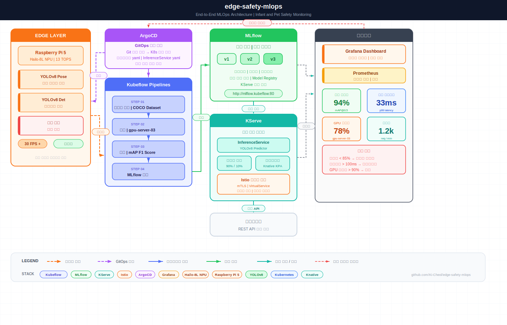

# 🛡️ edge-safety-mlops

> 영아 + 반려동물 실시간 안전 모니터링 시스템  
> Hailo-8L NPU 엣지 추론 + Kubeflow MLOps 파이프라인

---

## 📌 프로젝트 배경

라즈베리파이 + Hailo-8L NPU에서 YOLOv8 모델로 영아 수면 중 뒤집힘과 반려동물 접근을 실시간 감지합니다.

**문제 정의**
- 영아 수면 중 뒤집힘은 영아 돌연사(SIDS)의 주요 원인 중 하나
- Hailo 제공 범용 사전학습 모델은 영아/반려동물 특화 정확도가 낮음
- 새 데이터가 쌓일수록 자동으로 재학습 → 배포되는 MLOps 파이프라인 필요

---

## 🏗️ 아키텍처

> 📐 인터랙티브 아키텍처 다이어그램: [architecture.html](docs/images/architecture.html)

---

## 🔧 기술 스택

| 레이어 | 기술 |
|--------|------|
| 엣지 추론 | Hailo-8L NPU, YOLOv8, Raspberry Pi 5 |
| MLOps 파이프라인 | Kubeflow Pipelines |
| 모델 서빙 | KServe |
| 트래픽 제어 | Istio, Knative |
| 배포 자동화 | ArgoCD |
| 모니터링 | Grafana, Prometheus |
| 오케스트레이션 | Kubernetes |

---

## 🖥️ 테스트 환경

| 구분 | 사양 |
|------|------|
| K8s 클러스터 | ai-storage-master (control plane) |
| 워커 노드 | ai-storage-worker-01, csd-server-01 |
| GPU 서버 | gpu-server-03 (GPU x2) |
| 엣지 디바이스 | Raspberry Pi 5 + Hailo-8L NPU |
| MLOps 플랫폼 | Kubeflow Pipelines |
| 모델 서빙 | KServe (RawDeployment 모드) |
| 서비스 메시 | Istio 1.24.3 |

---

## 📂 프로젝트 구조
---

## 🚀 Why Hailo?

| | CPU (Pi 5) | Hailo-8L NPU |
|--|--|--|
| YOLOv8 FPS | ~3 FPS | ~30 FPS |
| 전력 소모 | 높음 | 낮음 |
| 실시간 감지 | ❌ | ✅ |

일반 라즈베리파이 CPU로는 YOLOv8 실시간 추론이 불가능합니다.  
Hailo-8L NPU(13 TOPS)를 사용해 30FPS 실시간 감지를 달성했습니다.

---

## 📊 MLOps 파이프라인 흐름
---

## ⚙️ 설치 가이드

[docs/setup.md](docs/setup.md) 참고

---

## 👤 Author

- GitHub: [@Ki-Cheol](https://github.com/Ki-Cheol)
